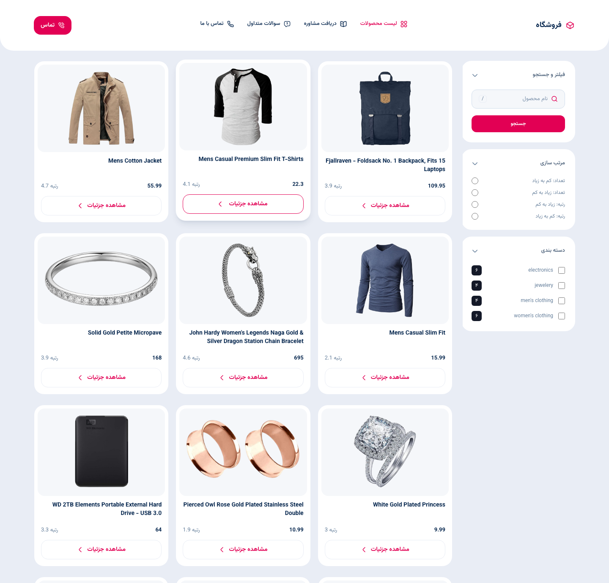
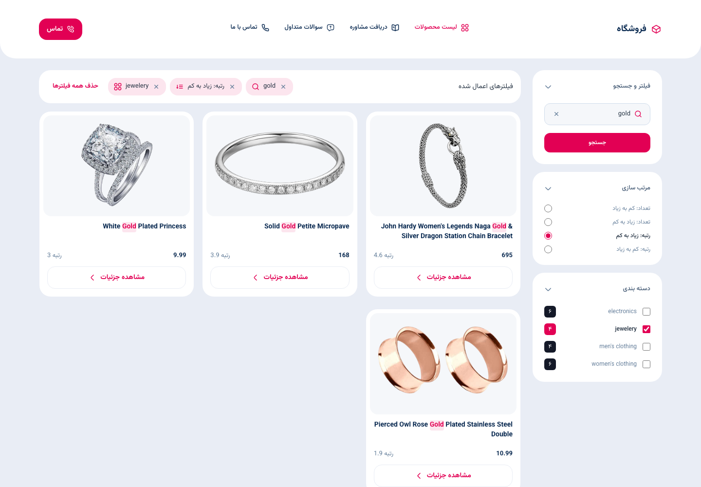
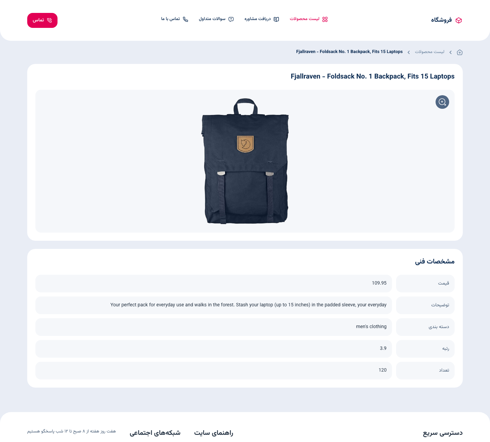
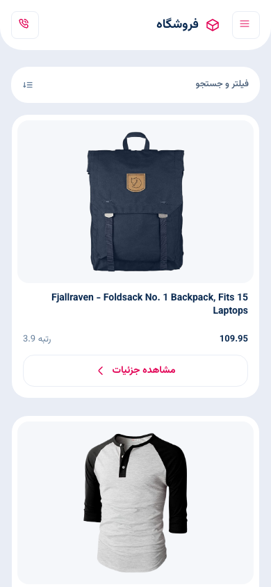
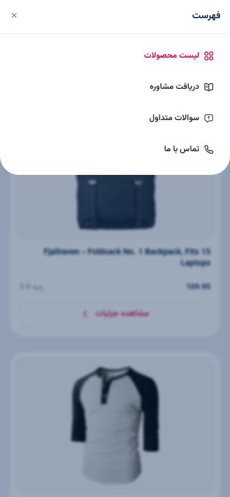

# Fake Store

A product list and product detail page built with **Nuxt 4**, **Vue 3** and **TypeScript**,
matching the Figma design and backed by the [Fake Store API](https://fakestoreapi.com).
The interface is Persian and right-to-left, as the design is.



## Quick start

```bash
nvm use            # Nuxt 4.5 needs Node 22+, the version is in .nvmrc
npm install
npm run dev        # http://localhost:3000
```

| Script            | Purpose                                    |
| ----------------- | ------------------------------------------ |
| `npm run dev`     | dev server                                 |
| `npm run build`   | format check, lint, type check, then build |
| `npm run preview` | serve the production build                 |
| `npm test`        | 165 tests across 22 files                  |

## Docker

```bash
docker build -t fake-store .
docker run -p 3000:3000 fake-store
```

Multi-stage: `node:22-alpine` builds, the same image runs Nitro's output. Rendering happens on
the server, so the artifact is a server rather than a folder of files and there is no nginx.

## Screens

|                                                        |                                                 |
| ------------------------------------------------------ | ----------------------------------------------- |
| **Filtered** — removable chips for every active filter | **Detail** — the spec table from the design     |
|              |        |
| **Phone** — single column with a filter trigger        | **Menu** — a real dialog, not a menu-shaped div |
|                   |             |

## Structure

```
app/
  app.vue  error.vue                    shell and error page
  assets/{fonts,icons,styles}/          fonts, Figma icons, design tokens
  pages/index.vue                       product list
  pages/products/[id].vue               product detail
  features/
    catalog/{api,model,ui}/             API client, filters, card, filter panel
    product/ui/                         hero, specs, breadcrumb
    site/ui/                            header, mobile menu, footer
  shared/{lib,ui}/                      number formatting and ui primitives
```

Code is grouped by feature, not by file kind. `shared/` never imports from `features/`, features
do not reach into each other, `ui/` stays presentational, `model/` holds the rules and `api/` is
the only layer that knows about the network. No barrel files.

The two directories Nuxt would auto-import, `components/` and `composables/`, are never created,
so every import is greppable and every component mounts in tests without a Nuxt runtime. Nuxt's
own composables are used only inside `pages/` and `app.vue`.

## Technical decisions

**Persian interface, product data untouched.** The design is Persian and the brief names the API
as the source of truth, so the interface — labels, states, the nav — is Persian while everything
about a product renders exactly as the API returns it: title, description, category name, price,
rating and rating count. Nothing is translated, reformatted or hard-coded, so a category added
upstream appears as-is. English text inside the RTL page is marked `dir="ltr"` so its punctuation
holds. Persian digits appear only on numbers the interface produces itself: category counts, the
result count and the active-filter badge.

**Filters live in the URL, not in a store.** `/?q=gold&category=jewelery&sort=rate-desc` is the
whole state. A filtered view is shareable, the back button removes one filter instead of leaving
the page, a refresh keeps it, and the server renders the filtered grid on first paint. Pinia is
not installed; a store here would be a second source of truth that the back button desynchronises.

**Search is submitted, not debounced, and matches titles only.** The design puts a «جستجو» button
under the field, which settles it: no debounce, no cancelled request, one history entry per search.
Searching descriptions would make "shirt" match half the catalogue for reasons the user cannot see.
A Persian query returns nothing, because the data is English — that empty state is working correctly.

**Categories go through the API; search and sort cannot.** Ticking a category calls
`/products/category/:name`, one request per category in parallel, and the skeleton covers the wait.
The API has nothing else to offer: every query parameter on `/products` (`?q=`, `?title=`,
`?search=`, `?category=`) is ignored and all 20 products come back, `/products/search` is read as a
product id, and `?sort` orders by id only. So search and sort run on the list already fetched, and
are instant. The full list is fetched once regardless, because the category counts need it; with
no category ticked the page uses it directly. Anything already fetched is kept, so a category picked
again, opening a product from the list, and going back all skip the network; the retry button always
refetches.

**Prices are the API's numbers, not تومان.** The design shows تومان, but converting needs an
exchange rate this app has no source for, and adding a currency symbol would be asserting something
the API never says.

**The card shows price and rating, which the design omits.** The sidebar offers to sort by rating
and by rating count; sorting by numbers the card never shows leaves the user watching the grid
reshuffle for no visible reason.

**Server-rendered, and a missing product is a real 404.** The detail page is the one worth sharing,
so its title and image are in the HTML. Static generation was rejected because prices and ratings
would freeze at build time. Asking the store for an id it does not have returns **200 with an empty
body**, not 404, so `res.ok` proves nothing and not-found is decided on the parsed payload. There is
no `server/api` proxy: the upstream is public, keyless and CORS-open.

**The menu, the filter sheet and the image lightbox are all one `<dialog>` primitive.**
`showModal()` provides the focus trap, Escape handling, an inert background and top-layer stacking,
so none of it is hand-written; a click on the backdrop closes it too. They animate in CSS alone —
`@starting-style` for the entrance, `allow-discrete` transitions on `display` and `overlay` so the
exit plays before the element leaves the top layer — sliding from the top, from the bottom, or
scaling in the centre. Reduced motion turns it off. The Figma has no mobile frame for the list, so that layout is mine: one column, a filter trigger showing
how many filters are active, and a bottom sheet rendering the **same `FilterPanel` the sidebar uses**,
so the two cannot drift apart.

**Interaction details.** The card photo morphs into the product page hero and back (View
Transitions API). It runs only when the page changes, never on a filter, and is skipped under
reduced motion; because the product page reuses the list's data, the morph starts in ~110 ms
instead of waiting ~300 ms on the API. Cards lift on hover and keyboard focus, and photos fade in —
but only those with nothing painted at hydration, so a half-loaded image never blinks. The desktop
filter sidebar is sticky. `/` focuses the search from anywhere (below `lg` it opens the sheet first),
declared with `aria-keyshortcuts`. Search matches are highlighted in each title with `<mark>`,
using the same rule as the filter, with no regex built from input and no `v-html`.

**Fonts are substituted.** Yekan Bakh and IRANYekan are commercial and not redistributable.
Vazirmatn (SIL OFL) is self-hosted in their place — two subsets, 80 KB, no CDN.

**Navigation entries link to `/` until their pages exist.** Every header, menu and footer entry is
a real link with a colour and underline animation on hover and focus. Because they all point to the
same URL, RouterLink would mark every one `aria-current="page"`; the attribute is set explicitly so
only «لیست محصولات» carries it. The تماس button dials `tel:+989120532128`. The tablet frame's
«درب‌های موجود» toggle is left out: no API field backs it, and a control that filters nothing is a
lie about the data.

**Nothing extra is installed.** At runtime only `nuxt`, `vue` and `vue-router`. No axios (native
`fetch`), no UI kit, no `@nuxt/image` (remote optimisation needs a provider; the real problem,
layout shift, is solved by a fixed aspect ratio), no i18n for one locale, no `.env` for a public
keyless API.

## Tests

```bash
npm test
```

165 tests in 22 files, co-located with what they test. Covered: the API mapping and each error it
can throw, including the 200-with-empty-body, and the per-category requests; reading and writing filters in the URL; all four
sorts; category counting; number formatting; and every component that takes props and emits events.
Assertions are on rendered text and ARIA attributes, never on internals.

Not covered, deliberately: `pages/**`, `app.vue`, `error.vue`, the header and the footer. They wire
Nuxt composables and hold no branching logic — every decision they make lives in `filters.ts` or in
a component that is covered.

## Known trade-offs

- jsdom does not implement `<dialog>`'s focus trap, so the tests cover the open/close contract and
  the trap itself was verified in a browser.
- Under SSR the loading state is mostly invisible, since the HTML arrives with the products in it.
  The skeleton shows on retry after a failure and on client-side entry with no payload.
- Images are served at full size from the API's own host; `loading="lazy"` and a fixed aspect ratio
  prevent layout shift but not the bytes.
- No caching or SWR, so every cold request hits upstream. The error state is the honest surface, with
  a retry button and no backoff.
- Products with equal ratings keep the order the store sent them in.
